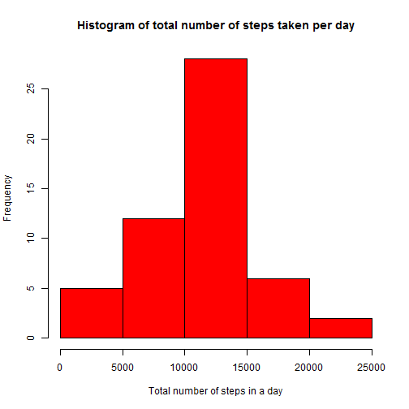
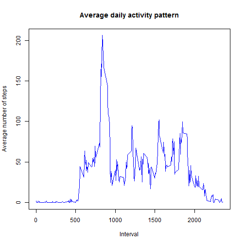
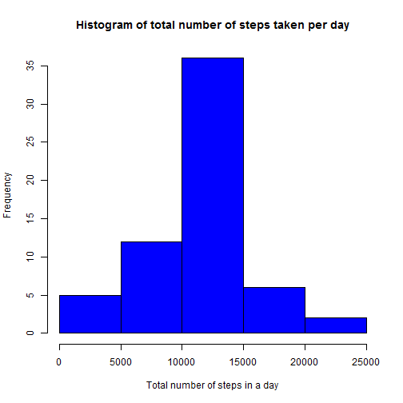

This assignment makes use of data from a personal activity monitoring device. This device collects data at 5 minute intervals through out the day. The data consists of two months of data from an anonymous individual collected during the months of October and November, 2012 and include the number of steps taken in 5 minute intervals each day.

## Loading and preprocessing the data
The data file activity.csv loaded into the data frame data. Then omit NA values and copy the date into another data frame

```r
df<-read.csv("activity.csv",sep=",", na.strings = "NA",header = TRUE,colClasses=c("integer", "Date", "integer"))
df1<-na.omit(df)
```


## What is mean and meadian total number of steps taken per day?

calculating the total number of steps taken each day

```r
total_steps <- tapply(df$steps, df$date, sum, na.rm=TRUE)
date_steps <- aggregate(steps ~ date, df, sum)
```
Create the histogram

```r
hist(date_steps$steps, col="red", main="Histogram of total number of steps taken per day", 
     xlab="Total number of steps in a day")
```

 

Calculate and report the mean and median of the total number of steps taken per day

```r
mean(date_steps$steps)
```

```
## [1] 10766.19
```

```r
median(date_steps$steps)
```

```
## [1] 10765
```

## What is the average daily activity pattern?
 
 plot of the 5-minute interval (x-axis) and the average number of steps taken, averaged across all days (y-axis)

```r
interval_steps <- aggregate(steps ~ interval, df1, mean)
plot(interval_steps$interval, interval_steps$steps, type='l', col="blue", 
main="Average daily activity pattern", xlab="Interval", ylab="Average number of steps")
```

 

Which 5-minute interval, on average across all the days in the dataset, contains the maximum number of steps?

```r
max_val<- max(interval_steps$steps)
interval_steps[interval_steps$steps==max_val,]$interval
```

```
## [1] 835
```

## Imputing missing values
Note that there are a number of days/intervals where there are missing values (coded as NA). The presence of missing days may introduce bias into some calculations or summaries of the data.

1. Calculate and report the total number of missing values in the dataset (i.e. the total number of rows with NAs)

2. Devise a strategy for filling in all of the missing values in the dataset. The strategy does not need to be sophisticated. For example, you could use the mean/median for that day, or the mean for that 5-minute interval, etc.

3. Create a new dataset that is equal to the original dataset but with the missing data filled in.

4. Make a histogram of the total number of steps taken each day and Calculate and report the mean and median total number of steps taken per day. Do these values differ from the estimates from the first part of the assignment? What is the impact of imputing missing data on the estimates of the total daily number of steps?

```r
sum(is.na(df))
```

```
## [1] 2304
```

```r
imp_df <- df
for (i in 1:nrow(imp_df))
{
  if (is.na(imp_df$steps[i]))
  {
    interval_val <- df$interval[i]
    row_id <- which(interval_steps$interval == interval_val)
    steps_val <- interval_steps$steps[row_id]
    imp_df$steps[i] <- steps_val
  }
}
date_steps <- aggregate(steps ~ date, imp_df, sum)
hist(date_steps$steps, col="blue", main="Histogram of total number of steps taken per day", 
     xlab="Total number of steps in a day")
```

 

```r
mean(date_steps$steps)
```

```
## [1] 10766.19
```

```r
median(date_steps$steps)
```

```
## [1] 10766.19
```
After imputation the means remain constant while there is a slight change in median.


## Are there differences in activity patterns between weekdays and weekends?
For this part the weekdays() function may be of some help here. Use the dataset with the filled-in missing values for this part.

1. Create a new factor variable in the dataset with two levels - "weekday" and "weekend" indicating whether a given date is a weekday or weekend day.

2. Make a panel plot containing a time series plot (i.e. type = "l") of the 5-minute interval (x-axis) and the average number of steps taken, averaged across all weekday days or weekend days (y-axis). See the README file in the GitHub repository to see an example of what this plot should look like using simulated data.


```r
imp_df$weekdays <- weekdays(as.Date(imp_df$date))
imp_df$weekdays <- ifelse(imp_df$weekdays %in% c("Saturday", "Sunday"),"weekend", "weekday")


average <-aggregate(steps ~ interval+weekdays, imp_df, mean)

library(lattice)
xyplot(steps ~ interval | weekdays, data = average, layout = c(1, 2), type="l", 
       xlab = "Interval", ylab = "Number of steps")
```

 
